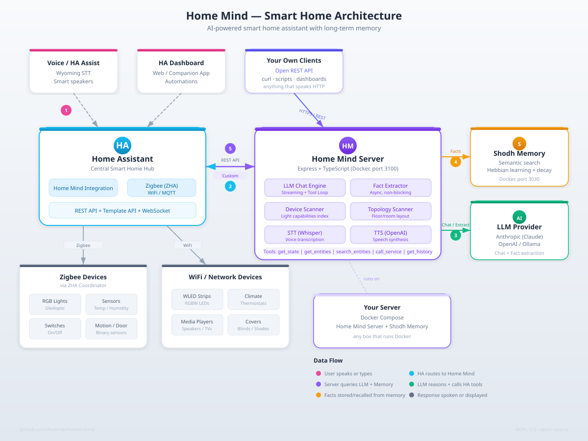

# Home Mind

[](https://www.gnu.org/licenses/agpl-3.0)
[](https://github.com/hoornet/home-mind/releases)
[]()

AI assistant for Home Assistant with cognitive memory. Adds learning capabilities, persistent memory, and voice control to your smart home.

## The Problem

Current Home Assistant AI integrations suffer from:

- **No persistent memory** - Forgets corrections and preferences between sessions
- **No learning capability** - Can't remember sensor baselines or user preferences
- **Stateless interactions** - Every conversation starts from zero

## The Solution

Home Mind provides:

- **Cognitive memory** with semantic search and natural decay (via Shodh Memory)
- **Learning** from corrections and user preferences
- **Forgetting on request** — "forget that my canary word is bumblebee"; it quotes the exact memory back and waits for your yes
- **Voice control** via HA Assist (Wyoming protocol)
- **Multi-LLM support** — Anthropic (Claude), OpenAI, or Ollama (local inference)
- **Home Layout Index** — reads your HA floor/room assignments and injects them into every prompt, so the AI always knows which floor a device is on
- **Device Capability Index** — pre-scans your lights at startup so the AI always uses the right color params on the first try
- **Self-hosted** and privacy-focused

## Memory in Action

Unlike stateless AI assistants, Home Mind **learns and remembers** across conversations:

**First Conversation:**
```
User: What's the NOx sensor reading?
AI: The NOx sensor shows 100 .

User: Is that high?
AI: Typically indoor NOx is 20-40 , so this seems elevated...

User: Actually, 100 is normal for my home. Remember that.
AI: I'll remember that 100  is within normal parameters for your NOx levels.
```

**Next Day (New Conversation):**
```
User: How's the air quality?
AI: The NOx sensor shows 98 ppm, which is within normal parameters for your home.
```

**Result:** Home Mind remembers the baseline without being reminded!

### What Gets Remembered

- Sensor baselines and thresholds
- Device nicknames and locations
- User preferences and patterns
- Corrections and clarifications

### Changed Your Mind?

Ask it to forget, and it confirms before deleting:

```
User: Forget that my canary word is bumblebee — it's honeybee now.
AI:   I'll forget exactly this memory: "User's test canary word is bumblebee".
      Shall I proceed?
User: yes
AI:   Forgotten. I'll remember that your canary word is now honeybee.
```

It only ever removes the one memory you named, and "don't forget to water the plants" is still a reminder, not a deletion. If several stored facts match what you said, it lists them and deletes nothing.

See [docs/MEMORY_EXAMPLES.md](docs/MEMORY_EXAMPLES.md) for more examples.

## Architecture



The short path: **HA Assist (voice or text) → Home Mind integration → Home Mind server → LLM + Shodh Memory + HA REST API**. The server also exposes its full REST API to any client you write yourself.

## Quick Start

### Prerequisites

- **Docker & Docker Compose** - [Install Docker](https://docs.docker.com/engine/install/) or run `curl -fsSL https://get.docker.com | sh`
- **Home Assistant** with a [long-lived access token](https://developers.home-assistant.io/docs/auth_api/#long-lived-access-token)
- **LLM API key** — [Anthropic](https://console.anthropic.com/) (default), [OpenAI](https://platform.openai.com/), or [Ollama](https://ollama.com/) (local, no API key needed)

### 1. Clone and Configure

```bash
git clone https://github.com/hoornet/home-mind.git
cd home-mind
cp .env.example .env
```

Edit `.env` with your credentials:
```bash
# LLM provider (default: anthropic, also supports: openai, ollama)
ANTHROPIC_API_KEY=sk-ant-api03-...
# Or for OpenAI: LLM_PROVIDER=openai and OPENAI_API_KEY=sk-...
# Or for Ollama: LLM_PROVIDER=ollama and LLM_MODEL=qwen2.5:14b (14B+ recommended — see Troubleshooting)
HA_URL=https://your-ha-instance:8123
HA_TOKEN=your-long-lived-access-token
# SHODH_API_KEY is auto-generated by deploy.sh
```

### 2. Deploy with Docker Compose

```bash
# Download the Shodh Memory binary (pinned — see note below)
cd docker/shodh
curl -sL https://github.com/varun29ankuS/shodh-memory/releases/download/v0.2.0/shodh-memory-linux-x64.tar.gz | tar -xz
cd ../..
# On arm64, swap linux-x64 for linux-arm64 in that URL.

# Deploy
./scripts/deploy.sh
```

> **Why the version is pinned:** `releases/latest` on that repo currently resolves to an ONNX model-asset release that contains no server binary, so `latest/download/...` returns 404. v0.2.0 is the current server release. If you're reading this much later, check their [releases page](https://github.com/varun29ankuS/shodh-memory/releases) for a newer `shodh-memory-linux-*` tarball.

### 3. Install HA Custom Component

**HACS (recommended):**
1. Add `https://github.com/hoornet/home-mind-hacs` as a custom repository in HACS (select **Integration** as the type)
2. Install "Home Mind"
3. Restart Home Assistant

That repository is the current, maintained integration — v0.10.0+, with a field for your `API_TOKEN`.

**Manual** (only if you don't use HACS):
```bash
cp -r src/ha-integration/custom_components/home_mind /config/custom_components/
```

> The copy vendored here is an older snapshot (v0.9.3) kept for offline installs. It predates API token support, so if you've set `API_TOKEN` on the server every request from it returns 401 — use HACS in that case.

### 4. Configure in Home Assistant

1. Settings → Devices & Services → Add Integration → Home Mind
2. Enter your Home Mind API URL (e.g., `http://192.168.1.100:3100`)
3. Set as conversation agent in Voice Assistants

## Custom Prompt

You can customize the AI's personality and behavior without touching the core system prompt. Your custom prompt **replaces the default identity** — it becomes the opening of the system prompt, giving it maximum authority over persona and tone. The built-in smart home capabilities (tool usage, memory, response style) are appended after your prompt. The AI still knows how to control devices, remember facts, and query sensors; your prompt shapes *who* it is and *how* it communicates.

### Setting a Custom Prompt

There are three ways, in order of precedence:

**1. Per-request** (API clients):
```bash
curl -X POST http://localhost:3100/api/chat \
  -H 'Content-Type: application/json' \
  -d '{"message": "hello", "customPrompt": "You are Ada, a warm and witty assistant."}'
```

**2. HA Integration** (recommended for most users):
Settings → Devices & Services → Home Mind → Configure → enter your custom prompt.

**3. Server-level default** (env var):
```bash
CUSTOM_PROMPT="You are Ada, a warm and witty assistant who loves wordplay."
```

If a per-request prompt is provided, it overrides the server default. If neither is set, the built-in prompt is used as-is.

### Tips for Effective Custom Prompts

- **Lead with identity**: Start with "You are [name], ..." — this becomes the very first thing the AI reads
- **Keep personality rules concise**: Shorter, punchier persona instructions work better than long rulebooks, especially on smaller models (Haiku, gpt-4o-mini)
- **Separate concerns**: Put personality in the custom prompt; let the built-in prompt handle tool usage and memory

### How It Differs from Anthropic Console / OpenAI Playground

In those tools, the system prompt **is** the entire system prompt — you control everything. Here, your custom prompt replaces the default identity line at the top of a larger prompt that also includes smart home tool instructions, memory guidelines, and dynamic context (time, remembered facts). You're defining the persona, not replacing the whole system.

## Home Layout Index

On startup, Home Mind queries the HA template API with Jinja2 functions (`floors()`, `floor_areas()`, `area_entities()`, etc.) and builds a compact map injected into every system prompt:

```
Ground Floor
- Living Room: climate.living_room_radiator, light.living_room_main, ...
First Floor
- Bedroom: climate.bedroom_radiator, light.bedroom_main, ...
```

This gives the AI spatial awareness without tool calls. It will never assume a device is on the wrong floor. Refreshes every 30 minutes automatically. Works automatically if you've assigned your devices to rooms and floors in Home Assistant — no configuration needed. Degrades gracefully if your HA version doesn't support the registry endpoints or if rooms/floors aren't set up.

## Device Capability Index

On startup, Home Mind scans all `light.*` entities in Home Assistant, reads their `supported_color_modes` attributes, and builds a per-entity cheat sheet that is injected into every system prompt. This means the AI always knows the correct way to control each light without needing to call `search_entities` or `get_entities` on every request.

The cheat sheet tells the AI exactly what to use per device:
- `rgbw_color: [0,0,0,255]` for RGBW strips (WLED, etc.) — uses the dedicated white LED channel
- `color_temp_kelvin` with the actual min/max range for lights that support it
- `rgb_color: [255,255,255]` for RGB-only lights without a white channel
- `xy_color: [x,y]` for lights that use CIE xy coordinates

The scanner refreshes every 30 minutes automatically.

### Fixing Devices with Incorrect HA-Reported Modes

Some devices report capabilities that don't match their actual wiring. A common case is the **Gledopto GL-C-008P** Zigbee controller: its firmware always reports `color_temp+xy` regardless of wiring mode. When wired as RGB-only, `color_temp_kelvin` does nothing.

Use `DEVICE_OVERRIDES` in your `.env` to pin the correct behavior for specific entities:

```bash
# Gledopto wired as RGB-only — use rgb_color for white instead of color_temp_kelvin
DEVICE_OVERRIDES={"light.gledopto_gl_c_008p": {"whiteMethod": "rgb_white"}}
```

Override fields:
- `whiteMethod`: `"color_temp"` | `"rgbw"` | `"rgb_white"` | `"none"`
- `colorMethod`: `"rgb_color"` | `"xy_color"` | `"hs_color"` | `"none"`

Only specify what needs changing — unspecified fields use auto-detected values.

## Available Tools

| Tool | Description |
|------|-------------|
| `get_state` | Get current state of an entity |
| `get_entities` | List entities by domain |
| `search_entities` | Search entities by name |
| `call_service` | Control devices (turn_on, turn_off, etc.) |
| `get_history` | Get historical state data |
| `forget_memory` | Forget a specific remembered fact (confirmed with the user first) |

## Home Mind or Nives?

**[Nives](https://github.com/hoornet/nives)** (formerly HomeMind PRO) is this project's sister: it began as a fork of this server, so the core — conversation engine and memory layer — is shared heritage. They're now maintained as two independent products for two kinds of people:

- **Home Mind (this repo)** is the DIY path: Docker Compose, run the server and Shodh Memory yourself, install the integration, wire it together, pick every model. Full control by design. Also the right choice if you're running outside Home Assistant OS (Proxmox, a NAS, bare Docker).
- **Nives** bundles the same stack into a **single HA add-on** — one container, self-installing companion integration, no terminal. It has also grown features this repo deliberately doesn't have: automation create/edit/delete by voice (behind a confirmation gate), an AI Task provider with camera-snapshot vision, Voice PE mic reopening, arm64 binaries for Raspberry Pi, and an optional managed-key subscription.

Both are AGPL-3.0 with open repos, and both are maintained. Nothing is locked behind the Nives subscription — its BYOK mode is free, exactly like Home Mind. Pick by temperament: own every moving part here, or have it just work there.

One thing worth knowing if you like this DIY setup but would rather not shop for a model or babysit an API key: a **[Nives Cloud](https://nives.house)** key works with Home Mind too. You keep this stack exactly as it is — your server, your Shodh, your data — and simply point it at a managed key instead of your own, with the model kept current for you. Entirely optional; BYOK stays free and always will.

The Quick Start above is the Home Mind path.

---

## Project Status

**Current version:** see the badge at the top, or [Releases](https://github.com/hoornet/home-mind/releases) — both read from the source, so neither can go stale.

- [x] Voice control via HA Assist
- [x] Cognitive memory with Shodh
- [x] Streaming responses
- [x] HACS integration
- [x] Multi-LLM provider support (Anthropic, OpenAI, OpenRouter, Ollama)
- [x] Local inference via Ollama (no API key needed)
- [x] Auto-detect and respond in user's language
- [x] Custom system prompt (AI personality customization)
- [x] Persistent conversation history (SQLite)
- [x] Automatic memory cleanup (low-confidence fact pruning)
- [x] Device Capability Index (pre-scanned light params, no per-request re-discovery)
- [x] Per-entity device overrides (`DEVICE_OVERRIDES`) for firmware quirks
- [x] Home Layout Index (floor/room awareness via HA template API)
- [x] Conversational forgetting (`forget_memory`, confirmed before deleting)
- [x] Server-side STT (`POST /api/stt`, OpenAI Whisper)
- [x] Server-side TTS (`POST /api/tts`, OpenAI TTS API)
- [x] Nives HA Add-on (one-click install, cloud + BYOK; formerly HomeMind PRO)
- [ ] Multi-user support (OIDC)

## Documentation

- [Wiki](https://github.com/hoornet/home-mind/wiki) - Full documentation
- [CHANGELOG.md](CHANGELOG.md) - Version history
- [CLAUDE.md](CLAUDE.md) - Development guide
- [docs/MEMORY_EXAMPLES.md](docs/MEMORY_EXAMPLES.md) - Memory system examples

## Troubleshooting

### "Unable to connect" in Home Assistant

1. Verify Home Mind server is running:
   ```bash
   curl http://your-server-ip:3100/api/health
   ```
2. Check the URL in integration config (use `http://`, not `https://`)
3. Ensure port 3100 is accessible from Home Assistant

### "Shodh Memory is not available"

Shodh must be running before the Home Mind server starts:
```bash
docker compose logs shodh          # Check Shodh logs
curl http://localhost:3030/health  # Test Shodh directly
docker compose restart             # Restart both services
```

### AI doesn't know about my devices

1. Verify Home Assistant connection:
   ```bash
   docker compose logs server | grep -i "home assistant"
   ```
2. Check `HA_URL` and `HA_TOKEN` in your `.env` file
3. Ensure the token hasn't expired (create a new long-lived token if needed)

### Ollama: model not found or slow startup

- Pull the model first: `ollama pull qwen2.5:14b`
- First request after pull may be slow (model loading into memory)
- Ensure `LLM_MODEL` matches an installed model: `ollama list`
- If running Ollama on a different machine, set `OLLAMA_BASE_URL=http://<host>:11434/v1`
- **Size matters more than family.** Small models tend to *narrate* tool calls rather than make them — `llama3.1:8b` will happily report "I've turned on the kitchen light" without ever calling the tool. Around 14B is where tool calling starts working reliably; `qwen2.5:14b` and up is a known-good starting point
- **Verify rather than trust**: ask it to change something you can see, then check the device actually changed. A convincing reply is not evidence of a tool call
- Give it **8k context or more** — the system prompt plus tool definitions come to roughly 3,200 tokens before you've said anything, so a 4k window is full before the conversation starts

### Slow responses (>30 seconds)

- Queries with device control require multiple API round-trips
- Check server logs for errors: `docker compose logs -f server`
- Verify you're using Claude Haiku (default), not Sonnet
- Ollama responses depend on your hardware — GPU acceleration recommended for 7B+ models

### Memory not working

1. Check Shodh is healthy: `curl http://localhost:3030/health`
2. Look for "Extracted facts" in server logs
3. Memory requires explicit statements like "remember that..." or corrections
4. If running an OpenAI-compatible local model (Ollama, LM Studio) and facts aren't being stored, run with `LOG_LEVEL=debug` and look for `Fact extractor:` warnings — some models return JSON in shapes the extractor has to recover from (single object instead of array, trailing prose after the JSON). As of 0.15.1 the extractor handles both, but a warning here means the response shape was unrecoverable and it's worth opening an issue with the raw output.

### Empty responses on qwen3.x and some OpenAI-compatible models

If you're getting `"I received your request but got no response"` from the assistant when using a qwen3.x model (or another OpenAI-compatible model that's strict about JSON output), set:

```bash
OPENAI_RESPONSE_FORMAT=json_object
```

That sends `response_format: { type: "json_object" }` on fact-extraction calls only — chat returns free-form text and ignores it. It's off by default because not all OpenAI-compatible providers accept the field, so turning it on globally would break them. Available since **v0.15.4** ([#21](https://github.com/hoornet/home-mind/issues/21)).

If replies come back truncated on a local model, raise the completion cap too:

```bash
OPENAI_MAX_TOKENS=2048
```

Note that this error string is our own generic fallback in the HA integration — it fires for *any* empty response field, so it doesn't by itself prove the JSON format is the cause. Run with `LOG_LEVEL=debug` and look at what the model actually returned before changing settings.

### Voice commands not working

1. Ensure Home Mind is set as the conversation agent in HA Voice Assistants
2. Disable "Prefer handling commands locally" in the voice assistant settings
3. Check HA logs: Settings → System → Logs → filter for "home_mind"

### View logs

```bash
docker compose logs -f server   # Home Mind server
docker compose logs -f shodh    # Shodh Memory
```

## Support the Project

If Home Mind is useful to you, consider supporting its development:

[](https://ko-fi.com/jure)

## Contact

- **Issues & Feature Requests**: [GitHub Issues](https://github.com/hoornet/home-mind/issues)
- **Author**: Jure Sršen ([@hoornet](https://github.com/hoornet))
- **Email**: 44338+hoornet@users.noreply.github.com

## License

Home Mind — AI assistant for Home Assistant with cognitive memory.
Copyright (c) 2026 Jure Sršen.

GNU Affero General Public License v3.0 - see [LICENSE](LICENSE) for details.

## Acknowledgments

- [Shodh Memory](https://github.com/varun29ankuS/shodh-memory) - Cognitive memory backend
- [Home Assistant](https://www.home-assistant.io) - Open source home automation
- [Anthropic Claude](https://www.anthropic.com) - AI model
- [OpenAI](https://openai.com) - AI model
- [Ollama](https://ollama.com) - Local LLM inference
